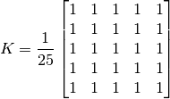
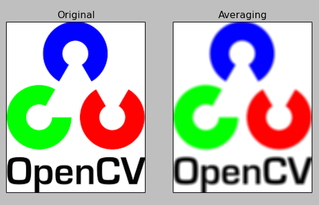

# Uint_4.4


## 平滑圖片


### 目標


* 
用各種低通濾波器模糊圖片
* 
應用定製的濾波器過慮圖片


### 2D卷積（圖片過濾）

對於一維信號，圖片可以用低通濾波（LPF）、高通濾波（HPF）等等。
低通濾波可以移除雜訊或模糊圖片，高通濾波可以找到圖片的邊緣。
OpenCV提供函數```cv2.filter2D()```去卷積圖片的核心。
在圖片上嘗試平均濾波。5x5的平均濾波內核可以被定義成：


用上面內核的結果的濾播會在下面被執行：
對於每個像素，5x5的視窗是像素的中心，所有的像素都是由視窗總結起來的，然後再除以25，這相當於計算視窗內像素值的平均。這會在每個圖片的像素被執行，以產生濾波後的輸出圖片。
例子：

```import cv2
import numpy as np
from matplotlib import pyplot as plt

img = cv2.imread('opencv_logo.png')

kernel = np.ones((5,5),np.float32)/25
dst = cv2.filter2D(img,-1,kernel)

plt.subplot(121),plt.imshow(img),plt.title('Original')
plt.xticks([]), plt.yticks([])
plt.subplot(122),plt.imshow(dst),plt.title('Averaging')
plt.xticks([]), plt.yticks([])
plt.show()```

結果：



### 圖片模糊（圖片平滑）

圖片模糊是用是低通濾播核卷積來實現，對於移除雜訊很有用。他實際上是移除圖片高頻的內容（像是雜訊、邊緣等），使用時就會導致圖片邊緣模糊。OpenCV主要提供4種模糊的方法：

* 平均：

